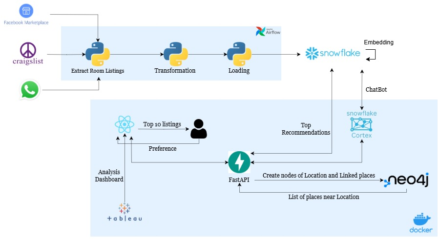
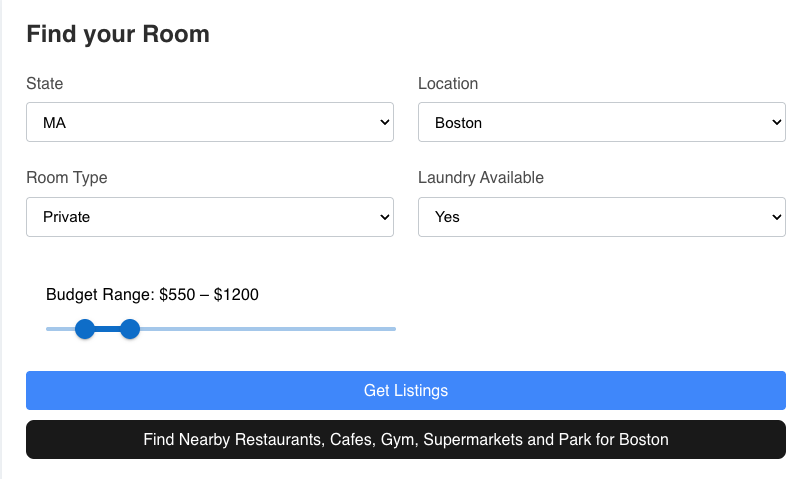
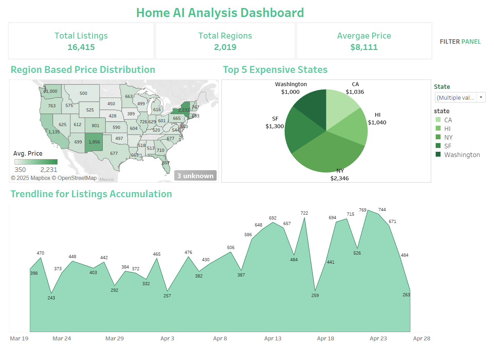

# HomieAI
HomieAI is built to make the process of finding budget-friendly shared housing easier and more organized. Right now, most people rely on scattered WhatsApp groups and Facebook Marketplace, which can be messy and time-consuming. This project aims to bring everything into one place for a smoother and more efficient experience.

[](https://codelabs-preview.appspot.com/?file_id=12itBNmCPvDPGoQZRLQj9TXRsB-O6feUUO2VdW6u5b6E#0)

## Live application link

[](http://76.152.120.193:4173/)

## Technologies Used
[](https://react.dev/)
[](https://fastapi.tiangolo.com/)
[](https://www.snowflake.com/)
[](https://airflow.apache.org/)
[](https://spark.apache.org/docs/latest/api/python/)
[](https://www.docker.com/)
[](https://neo4j.com/)
[](https://www.tableau.com/)
[](https://aws.amazon.com/)

**Challenge:**
Searching for a room today means bouncing between WhatsApp chats, Facebook Marketplace posts, and inconsistent Craigslist listings. Messages are often outdated, unstructured, and impossible to filter by what matters most—budget, room type, or location. This chaotic and inefficient system causes frustration and missed opportunities for users.

**Solution:**
HomeAI transforms this disorganized process into a centralized, smart platform. By scraping data from major sources, structuring it into a clean database, and enabling intelligent search and filters, HomeAI saves users time, energy, and uncertainty. Early career professionals, interns, and those seeking short-term housing can now find the perfect room, faster and easier.

## Architecture



**Key Components:**
- **Data Scraping:** Marketplace, Craigslist, WhatsApp chat exports
- **ETL Pipelines:** Airflow orchestrates PySpark transformations and Snowflake loads
- **Database:** Listings stored in Snowflake
- **API Backend:** FastAPI serves room listing APIs
- **Frontend:** React-based application for user interaction
- **Analytics & Graphs:** Neo4j for relationship graphs, Tableau for visual insights
- **Deployment:** Dockerized services deployed on AWS


## Features

- Smart search based on location, budget, room type, and amenities
- Personalized room recommendations based on user preferences
- Relationship graph between listings, locations, and nearby amenities (Neo4j)
- Real-time listing updates with scraping pipelines
- Interactive data analytics dashboards for insights (Tableau)
- Secure user authentication (FastAPI + Snowflake)
- Responsive, mobile-friendly UI (React)

## Project Tree

```
📦 
├─ .gitignore
├─ README.md
├─ airflow
│  ├─ .env.example
│  ├─ .gitignore
│  ├─ .gitkeeper
│  ├─ airflowimage
│  │  └─ Dockerfile
│  ├─ dags
│  │  ├─ craigslist_data_dag.py
│  │  ├─ email_notification_dag.py
│  │  ├─ facebook_metadata_dag.py
│  │  ├─ helper
│  │  │  └─ snowflake_helper.py
│  │  ├─ scripts
│  │  │  ├─ craigslist
│  │  │  │  ├─ load_listings.py
│  │  │  │  └─ transform_listings.py
│  │  │  ├─ email
│  │  │  │  └─ sendemail.py
│  │  │  ├─ facebook
│  │  │  │  ├─ load_data.py
│  │  │  │  └─ transform_data.py
│  │  │  └─ whatsapp
│  │  │     └─ load_data.py
│  │  ├─ spark
│  │  │  ├─ craigslist
│  │  │  │  └─ extract_listing.py
│  │  │  ├─ facebook
│  │  │  │  ├─ extract_listing.py
│  │  │  │  ├─ extract_metadata.py
│  │  │  │  └─ transform_listing.py
│  │  │  └─ whatsapp
│  │  │     ├─ extract_listing.py
│  │  │     └─ transform_listing.py
│  │  └─ whatsapp_data_dag.py
│  ├─ docker-compose.yaml
│  ├─ requirements.txt
│  └─ sparkimage
│     └─ Dockerfile
├─ backend
│  ├─ Dockerfile
│  ├─ connections.py
│  ├─ docker-compose.yml
│  ├─ main.py
│  ├─ neo4j_client.py
│  ├─ requirements.txt
│  └─ routes
│     ├─ authRoutes.py
│     ├─ listingRoutes.py
│     ├─ mapRoutes.py
│     └─ preferenceRoute.py
├─ homeAI-app
│  ├─ .gitignore
│  ├─ Dockerfile
│  ├─ README.md
│  ├─ docker-compose.yml
│  ├─ eslint.config.js
│  ├─ index.html
│  ├─ package-lock.json
│  ├─ package.json
│  ├─ public
│  │  ├─ logo.jpg
│  │  └─ vite.svg
│  ├─ src
│  │  ├─ App.css
│  │  ├─ App.jsx
│  │  ├─ STATE_CITY_MAP.jsx
│  │  ├─ assets
│  │  │  ├─ background.jpg
│  │  │  ├─ logo.jpg
│  │  │  └─ react.svg
│  │  ├─ components
│  │  │  ├─ ListingCard.jsx
│  │  │  ├─ LoginSIgnup.jsx
│  │  │  ├─ Navbar.jsx
│  │  │  ├─ NearbyPlaces.jsx
│  │  │  ├─ PreferenceListingsChat.css
│  │  │  ├─ PreferenceListingsChat.jsx
│  │  │  ├─ PreferencesWizard.css
│  │  │  ├─ PreferencesWizard.jsx
│  │  │  └─ styles.css
│  │  ├─ index.css
│  │  └─ main.jsx
│  └─ vite.config.js
├─ requirements.txt
├─ screenshots
│  ├─ architecture.jpg
│  └─ dashboard.png
├─ snowflake_setup
│  ├─ procedure_setup.sql
│  ├─ stages_setup.sql
│  ├─ tables_setup.sql
│  └─ tasks_setup.sql
└─ web_driver
   └─ docker-compose.yaml
```
©generated by [Project Tree Generator](https://woochanleee.github.io/project-tree-generator)

## Application UI

**Filter and Select - Get Listings or Find Nearby Hotspots**  



**Get matched listings based on your preferences**  


**Find Restaurants, Cafes, Gym, Supermarkets and Park for your preferred location**  


## Relationship Graph with Neo4j

HomeAI uses Neo4j to map listings to nearby places like parks, cafes, gyms, and restaurants. This enables users to search not just for rooms, but for neighborhoods that match their lifestyle preferences.


Listings (:Listing nodes) are connected to nearby amenities (:Place nodes) using :NEARBY relationships. Each Place node stores structured properties like name, address, rating, and type, enabling graph-based contextual search and filtering.


## 📊 Analytics 



## Future Enhancements
- Allow user-contributed reviews
- Implement advanced filters (pet-friendly, furnished, lease duration)
- Geo-search for nearby attractions and commute times

## 👥 Authors

- **Monil Shah** 
- **Muskan Deepak Raisinghani** 
- **Rachana Keshav** 


Built with passion to simplify room hunting! 🏡💜


